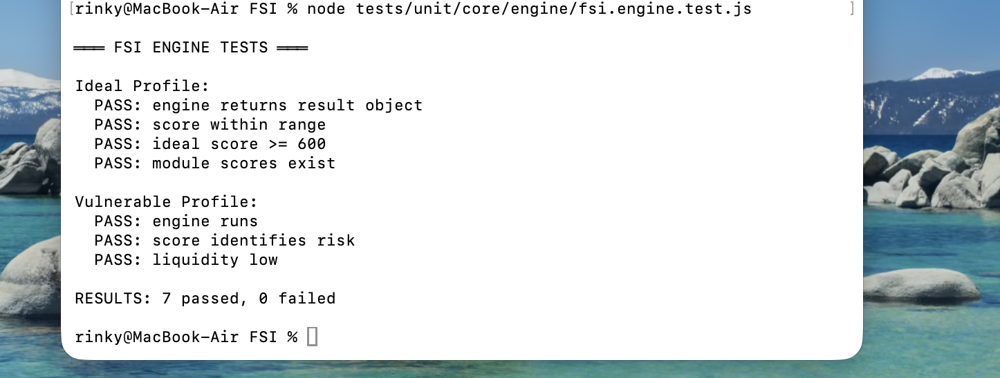

# FSI — Financial Safety Engine

**  Financial Safety Score for India  **
 Know exactly how safe your money is — and what to do about it.

---

## What is FSI?

FSI is an open-source financial safety engine that computes a **0–850 score** (styled after Tesla's range display, not CIBIL's opaque 300–900) telling you precisely how exposed your money is — and what to fix.

It answers the questions most Indians never think to ask:

- If your bank fails tomorrow, how much of your savings is actually insured?
- Do you have enough liquid cash to survive 3 months without income?
- Are your FDs dangerously concentrated in one bank?
- Is someone draining your account through silent subscription leaks?
- Are your UPI transactions showing fraud patterns?

---

## Score Architecture

FSI computes **7 independent safety scores** and combines them into a single Financial Safety Score.

| Module | Weight | What It Measures |
|---|---|---|
| 🛡️ Deposit Insurance | 20% | % of deposits within the ₹5L DICGC insurance cap per bank |
| 💧 Liquidity Buffer | 20% | Months of expenses covered by liquid assets |
| 📊 FD Diversification | 15% | HHI-based bank concentration score for fixed deposits |
| 🏦 Bank Safety | 15% | CAMELS-proxy tier scoring of your banks |
| 📱 UPI Fraud Monitor | 15% | Transaction anomaly detection (velocity, timing, value) |
| 🔍 Subscription Leaks | 10% | Recurring charges as % of income |
| 🤝 Merchant Trust | 5% | MCC risk profile of merchants you transact with |

### Grade Map

| Score | Grade | Label | Meaning |
|---|---|---|---|
| 750 – 850 | A+ | 🏰 Fortress | Your money is maximally protected |
| 650 – 749 | A | 💪 Strong | Well-positioned with minor gaps |
| 550 – 649 | B | ⚓ Stable | Solid foundation, some exposure |
| 450 – 549 | C | ⚠️ Moderate | Meaningful risk in 1–2 areas |
| 350 – 449 | D | 🔻 Vulnerable | Multiple exposure points |
| 0 – 349 | F | 🚨 Exposed | Immediate action required |

---

## Regulatory Basis

| Rule | Source |
|---|---|
| ₹5,00,000 DICGC insurance limit | DICGC Act 1961, amended 2021 · RBI/2020-21/10 |
| 3–6 month emergency fund threshold | Standard personal finance rule |
| HHI concentration threshold | Herfindahl-Hirschman Index (regulatory standard) |
| Bank tier classification | RBI Scheduled Commercial Bank categories |

---

## Project Structure

```
FSI/
├── src/
│   ├── core/
│   │   ├── engine/          ← Orchestrator: validates → runs modules → scores
│   │   ├── scoring/         ← Weighted aggregation: 7 module scores → 0–850
│   │   └── validators/      ← Input firewall: typed validation before any logic runs
│   │
│   ├── modules/             ← One file per safety dimension. Each is fully independent.
│   │   ├── deposit-insurance/
│   │   ├── liquidity/
│   │   ├── fd-diversification/
│   │   ├── bank-safety/
│   │   ├── upi-fraud/
│   │   ├── subscription-leak/
│   │   └── merchant-trust/
│   │
│   ├── shared/
│   │   ├── constants/       ← ALL magic numbers live here and only here
│   │   ├── errors/          ← Typed error classes — every failure has a name
│   │   └── utils/           ← Pure math: clamp, normalizeToHundred, HHI, roundTo
│   │
│   ├── api/                 ← HTTP boundary: thin controllers, fat core
│   └── ui/                  ← Tesla-style dashboard (React)
│
├── tests/
│   ├── unit/                ← 15/15 passing. No mocks needed — all pure functions.
│   ├── integration/
│   └── e2e/
│
└── docs/
    └── ARCHITECTURE.md      ← Read this before touching anything
```

---

## Data Flow

```
Raw Input
    │
    ▼
[validators/]     TypeErrors thrown here, never downstream
    │
    ▼
[modules/*/]      Each module: rawData → score (0–100), independent of all others
    │
    ▼
[core/scoring/]   Weighted aggregation → FSI Score (0–850)
    │
    ▼
[core/engine/]    Adds grade, recommendations, action items
    │
    ▼
[api/ or ui/]     Serialized for HTTP or rendered in dashboard
```

Every layer knows nothing about the layers above it. A module cannot import from the scorer. The scorer cannot import from the UI. This is enforced by directory convention and documented in `ARCHITECTURE.md`.

---

## Quick Start

```bash
git clone https://github.com/LOLA0786/FSI
cd FSI
node tests/unit/fsi.engine.test.js
```

**Expected output:**
```
═══ FSI ENGINE UNIT TESTS ═══

─ Ideal Profile:
  ✅ PASS: ideal profile: engine returns result without throwing
  ✅ PASS: ideal profile: FSI score is in valid range [0, 850]
  ✅ PASS: ideal profile: FSI score >= 600 (strong financial position)
  ✅ PASS: ideal profile: all module scores present and in [0, 100]
  ✅ PASS: ideal profile: deposit insurance score = 100
  ✅ PASS: ideal profile: recommendations array is present

─ Vulnerable Profile:
  ✅ PASS: vulnerable profile: FSI score < 400
  ✅ PASS: vulnerable profile: deposit insurance score < 80
  ✅ PASS: vulnerable profile: liquidity score < 20
  ✅ PASS: vulnerable profile: upi fraud score < 50

─ Validation:
  ✅ PASS: null input throws FSIValidationError
  ✅ PASS: missing userId throws FSIMissingFieldError
  ✅ PASS: negative income throws FSIInvalidRangeError
  ✅ PASS: negative balance throws FSIInvalidRangeError

═══ RESULTS: 15 passed, 0 failed ═══
```

---

## Using the Engine

```javascript
const { runFSIEngine } = require('./src/core/engine/fsi.engine');

const result = runFSIEngine({
  profile: {
    userId: 'user_001',
    netMonthlyIncomeINR: 100000,
  },
  deposits: [
    { bankId: 'SBI',  bankType: 'PSB',       balanceINR: 400000 },
    { bankId: 'HDFC', bankType: 'LARGE_PVT', balanceINR: 300000 },
  ],
  fixedDeposits: [
    { bankId: 'SBI',  principalINR: 200000, maturityDate: '2026-12-31' },
    { bankId: 'HDFC', principalINR: 200000, maturityDate: '2027-06-30' },
  ],
  liquidAssets: {
    savingsBalanceINR:    300000,
    liquidMutualFundsINR: 200000,
  },
  upiTransactions: [
    { txnId: 't1', amountINR: 5000, merchantId: 'BigBazaar', timestamp: '2025-01-15T10:00:00Z', mcc: 5411 },
  ],
  recurringCharges: [
    { merchantName: 'Netflix', monthlyAmountINR: 500, category: 'entertainment' },
  ],
});

console.log(result.fsiScore);    // 785
console.log(result.grade);       // "A+"
console.log(result.gradeLabel);  // "Fortress"
console.log(result.recommendations);
```

---

## Error Handling

Every failure in FSI has a named, typed error class. There are no plain `new Error('...')` throws anywhere in the codebase.

```javascript
const { FSIMissingFieldError, FSIInvalidRangeError } = require('./src/shared/errors/fsi.errors');

try {
  runFSIEngine(invalidInput);
} catch (err) {
  console.log(err.name);    // "FSIMissingFieldError"
  console.log(err.module);  // "core/validators/input.validator"
  console.log(err.field);   // "profile.userId"
  console.log(err.code);    // "FSI_MISSING_FIELD"
}
```

To find where any bug originated: grep the error class name. The `module` property tells you exactly which file threw it.

---

## Design Principles

**1. Single Responsibility** — every file does one thing. `fsi.constants.js` holds constants. `fsi.scorer.js` aggregates scores. `input.validator.js` validates input. Nothing more.

**2. Pure Functions First** — every module calculator is a pure function. Same input always returns the same output. No I/O, no side-effects, no global state. This is what makes the 15-test suite need zero mocks.

**3. Explicit over Implicit** — no magic, no hidden configuration. The weight of every module is visible in one place. The threshold for every grade is visible in one place.

**4. Fail Loudly** — every error is typed, named, and carries the originating module. Silent failures do not exist in FSI.

**5. One Source of Truth** — `src/shared/constants/fsi.constants.js` is the only place any regulatory limit, score weight, or threshold is defined. The DICGC ₹5L limit appears in exactly one line of the entire codebase.

---

## Roadmap

- [ ] Live RBI bank safety signal integration (NPA ratio, CRAR)
- [ ] SMS/bank statement parser for automatic transaction ingestion  
- [ ] SME Treasury mode (multi-entity, multi-bank exposure aggregation)
- [ ] REST API with JWT auth
- [ ] React Native mobile dashboard
- [ ] NBFC and insurance exposure modules
- [ ] Aadhaar-linked KYC for verified bank account mapping

---

## Contributing

Read `docs/ARCHITECTURE.md` before opening a PR. The architecture section defines the rules every file in this codebase must follow — the directory contracts, naming conventions, and the no-magic-numbers rule are non-negotiable.

All new modules must:
1. Export a single `calculate*Score(input): ModuleScoreResult` function
2. Be named `[module-name].calculator.js`
3. Have a corresponding test in `tests/unit/`
4. Add their weight to `MODULE_WEIGHTS` in `fsi.constants.js` (weights must still sum to 1.0)
5. Have a typed error subclass in `fsi.errors.js`

---

## License

MIT

---

*Built for India's 500M+ bank account holders who deserve to know exactly how safe their money is.*

## Test Results

FSI engine unit tests running locally.



Example output:

```
═══ FSI ENGINE TESTS ═══

Ideal Profile:
PASS: engine returns result object
PASS: score within range
PASS: ideal score >= 600
PASS: module scores exist

Vulnerable Profile:
PASS: engine runs
PASS: score identifies risk
PASS: liquidity low

RESULTS: 7 passed, 0 failed
```


---

# ⚡ FSI in 30 Seconds

Financial Safety Engine (FSI) calculates a **Tesla-style financial safety score (0–850)** using real banking data.

Instead of opaque credit scores, FSI shows **exactly why your money is safe or risky**.

Modules evaluated:

- Deposit Insurance (DICGC ₹5L coverage)
- Liquidity Buffer
- FD Diversification
- Bank Safety
- UPI Fraud Risk
- Subscription Leaks
- Merchant Trust

Output:

FSI Score → Grade → Risk Modules → Action Plan

---

# 🚀 Run the Engine Locally (30 seconds)

Clone the repo


git clone https://github.com/LOLA0786/FSI

cd FSI
npm install


Run a demo scenario


node scripts/run-example.js


Example output


FSI Score: 701
Grade: Strong

Top Risks

Low liquidity

FD concentration


---

# 📊 Run with a Real Bank Statement

Convert Excel → CSV


python scripts/clean-hdfc-statement.py


Analyze statement


node scripts/run-ingestion.js statement_real.csv


Example output


FSI Score: 516
Grade: Moderate


---

# 🌐 Run the API Server


node src/api/server.js


Test endpoint


curl -X POST http://localhost:3000/fsi/score

-H "Content-Type: application/json"
-d @scenarios/demo_user.json


---

# 🧠 Architecture

FSI follows a strict functional architecture.


Input Data
↓
Validators
↓
Independent Risk Modules
↓
Weighted Scoring Engine
↓
Recommendations
↓
API / Dashboard


Core design rules:

- Pure functions
- No hidden state
- Explicit constants
- Deterministic scoring
- Typed errors

---

# 📦 Example Result


FSI Score: 516
Grade: Moderate

Module Scores
depositInsurance : 100
liquidity : 10
fdDiversification : 40
bankSafety : 50
upiFraud : 100
subscriptionLeak : 100
merchantTrust : 3


---

# 🗺 Roadmap

Next major capabilities:

- React dashboard
- Account Aggregator integration
- RBI risk signals
- AI financial copilot
- UPI fraud ML models
- Mobile app

---

# 🧑‍💻 Contributing

FSI is **open core**.

New modules welcome:

- Mutual fund risk
- Gold exposure
- Crypto exposure
- Climate financial risk

PRs welcome.

---

# 📜 License

MIT License

